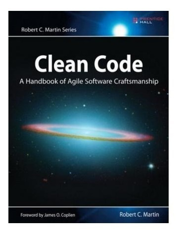
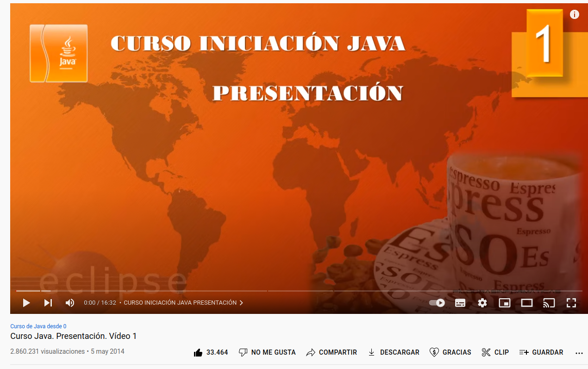

# Hi, I'm Andrea Ghiorsi Moraes:  a Java Software Developer

[View my resume](https://docs.google.com/document/d/1KvpQWdfTtV838wfyrpa9R2fuxcvS0-gbW2pab6xMfik/edit?usp=sharing)

<h3 align="left">I am an accountant who has migrated to the world 
of programming in an autodidact way and recently started my formal
studies.
In my GitHub you can see the projects in which I have been 
working to expand and be able to capture the knowledge acquired.

###
 

###

<h3 align="left">In this profile you can see the projects in which I have
been working in order to expand and be able to capture the knowledge
acquired.
 
 
 
You will be able to appreciate that some of my projects are about 
YouTube courses (for example: "Java desde Cero - Pildoras Informaticas" in which I was able 
to acquire and apply valuable knowledge on, for example, 
Collections, Sockets.
</h3>

 

 

Soft skills 
 
- Passion for learning 
- Teamwork

###

Learning 
 
- Clean Code 📝  

###

###
